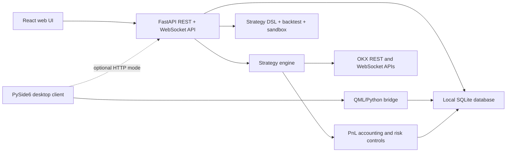

# QuantOKX

QuantOKX is a local-first quantitative trading platform for OKX. It combines a FastAPI backend, a React dashboard, a visual strategy DSL, historical backtesting, strategy-level PnL attribution, risk controls, and an optional PySide6 desktop client.

> [!WARNING]
> This project can place real orders when an account uses `live` mode. Trading involves substantial risk. Start with an OKX demo account, use API keys without withdrawal permission, and review the code and strategy configuration before using real funds.

## Highlights

- **Local-first credential storage** — OKX credentials are encrypted with Fernet and stored in a local SQLite database.
- **Demo and live trading** — supports OKX spot and perpetual-swap workflows.
- **Multiple strategy types** — grid, trend, arbitrage, advanced grid hedge, and composable DSL strategies.
- **Visual strategy DSL** — indicators, conditions, events, actions, validation, and dry-run simulation.
- **Backtesting** — historical candle replay with fees, slippage, drawdown, Sharpe ratio, win rate, and export to a strategy instance.
- **Strategy-level PnL attribution** — virtual positions, realized/unrealized PnL, periodic snapshots, and exchange-position reconciliation.
- **Risk controls** — capital limits, leverage configuration, margin monitoring, and multi-strategy position-conflict checks.
- **Operations tooling** — notifications, monitoring, API-call logs, maintenance endpoints, and proxy support.
- **Two user interfaces** — React/Vite web dashboard and an optional PySide6/QML desktop application.

## Architecture



| Layer | Main technologies | Location |
| --- | --- | --- |
| Web UI | React 19, TypeScript, Vite, Tailwind CSS, Recharts | [`frontend/`](frontend/) |
| HTTP/WS API | FastAPI, Uvicorn | [`backend/main.py`](backend/main.py) |
| Trading services | HTTPX, OKX REST/WebSocket integrations | [`backend/services/`](backend/services/) |
| Strategy runtime | Built-in strategies and composable DSL | [`backend/strategies/`](backend/strategies/), [`backend/dsl/`](backend/dsl/) |
| Persistence | SQLAlchemy and SQLite | [`backend/database.py`](backend/database.py), [`backend/models/`](backend/models/) |
| Desktop UI | PySide6 and QML | [`desktop/`](desktop/) |

## Requirements

- Python 3.10 or newer
- Node.js 18 or newer
- npm
- Windows 10/11 for the bundled installer and `.bat` scripts
- Network access to the OKX API, or a configured proxy

## Quick start

### Windows helper scripts

Run the installer script once from the project root:

```bat
install.bat
```

It checks Python, Node.js, the Visual C++ runtime, creates `backend\.venv`, installs backend and frontend dependencies, and creates `.env` from `.env.example` when needed.

Start the development servers with:

```bat
start.bat
```

Then open <http://127.0.0.1:5173>.

### macOS helper scripts

The macOS installer checks Python 3.10+, Node.js 18+, npm, and Xcode Command Line Tools. When required and Homebrew is already available, it installs missing Python or Node.js versions. It then creates `backend/.venv`, installs the backend and frontend dependencies, creates `.env`, and generates a random JWT secret.

```bash
chmod +x install_mac.sh start_mac.sh
./install_mac.sh
./start_mac.sh
```

The startup script runs the FastAPI backend and Vite frontend together, opens <http://127.0.0.1:5173>, and stops both processes when you press `Ctrl+C`.

### Manual setup (Windows, macOS, or Linux)

On macOS or Linux, from the repository root:

```bash
cp .env.example .env

python3 -m venv backend/.venv
source backend/.venv/bin/activate
python -m pip install --upgrade pip
python -m pip install -r backend/requirements.txt python-dotenv

cd frontend
npm install
cd ..
```

On Windows PowerShell, use `Copy-Item .env.example .env` instead of `cp`, and activate the environment with `backend\.venv\Scripts\Activate.ps1`. The remaining `python`, `pip`, and `npm` commands are the same.

Start the backend in one terminal:

```bash
cd backend
source .venv/bin/activate  # Windows PowerShell: .venv\Scripts\Activate.ps1
python -m uvicorn main:app --reload --host 127.0.0.1 --port 8000
```

Start the frontend in another terminal:

```bash
cd frontend
npm run dev
```

Open:

- Web dashboard: <http://127.0.0.1:5173>
- OpenAPI documentation: <http://127.0.0.1:8000/docs>

On the first backend startup, the application creates a local database and the development account `admin` / `admin123`. **Change this password immediately in Settings. Do not expose the server to a network with the default credentials.**

## Configuration

Copy [`.env.example`](.env.example) to `.env` and review these settings:

| Variable | Default | Purpose |
| --- | --- | --- |
| `JWT_SECRET_KEY` | insecure development value | JWT signing secret; replace with a long random value |
| `HOST` | `127.0.0.1` | Backend bind address |
| `PORT` | `8000` | Backend port |
| `PRODUCTION` | `false` | Production-mode marker |
| `CORS_ORIGINS` | empty | Comma-separated origins for a separately hosted frontend |
| `OKX_BASE_URL` | `https://openapi.okx.com` | Primary OKX API endpoint |
| `OKX_ALT_URLS` | OKX alternatives | Comma-separated fallback endpoints |
| `OKX_DNS_OVERRIDE` | empty | Optional `host:ip` DNS overrides |
| `OKX_PROXY` | empty | Optional HTTP proxy, for example `http://127.0.0.1:7897` |

Runtime data is stored under `data/` during source development. The SQLite database, encryption key, `.env`, logs, and backend runtime data are excluded by `.gitignore`.

## First-use checklist

1. Replace `JWT_SECRET_KEY` with a randomly generated secret.
2. Log in and change the default administrator password.
3. Create an OKX **demo** API key with read/trade access and no withdrawal permission.
4. Add the account through the Accounts page and confirm connectivity.
5. Backtest or dry-run a strategy before creating an instance.
6. Start with a small capital limit and monitor orders, PnL, margin, and reconciliation alerts.
7. Move to live mode only after reviewing the strategy and operational safeguards.

## Main workflows

### Strategies

The platform separates reusable strategy templates from account-bound strategy instances. Templates can be imported/exported as JSON, and running instances can be started, paused, resumed, stopped, and monitored.

The QS-Model configuration has four sections:

- `meta` — identity and descriptive metadata
- `params` — configurable strategy parameters
- `logic` — indicators, conditions, actions, events, and state transitions
- `risk_filter` — capital and execution safeguards

See the [strategy writing guide](docs/strategy-writing-guide.md) for the complete schema and examples.

### Backtesting and sandboxing

- **Backtesting** replays historical candles and produces performance metrics and trades.
- **DSL dry-run** previews a composable strategy and returns a step-by-step event timeline.
- **Sandbox mode** runs against real-time inputs without placing exchange orders.

These tools reduce risk but do not reproduce all live-market effects such as liquidity, latency, and partial fills.

### PnL and monitoring

The accounting engine maintains strategy-level virtual positions and PnL snapshots. Monitoring endpoints compare aggregate virtual positions with the exchange position, report conflicts between strategies sharing an account/symbol, and expose health and event data.

## Tests

The repository currently contains unit, integration, end-to-end, and performance tests under [`backend/tests/`](backend/tests/). Install the test-only tools, then run the default suite:

```bash
cd backend
python -m pip install pytest pytest-asyncio
python -m pytest
```

The default `pytest.ini` excludes `tests/e2e`. E2E and performance tests should be run deliberately in an isolated environment. Review the E2E configuration before supplying any demo-account credentials.

```bash
python tests/run_e2e_tests.py --report
python -m pytest tests/perf -m perf
```

Build and lint the frontend with:

```bash
cd frontend
npm run lint
npm run build
```

## Production-style local build

Build the frontend, then use the backend launcher to serve the generated UI and API from one process:

```bash
cd frontend
npm run build
cd ../backend
python launcher.py
```

Keep the default `HOST=127.0.0.1` unless authentication, TLS, firewall rules, backups, and process supervision have been reviewed. The current codebase is designed primarily for a trusted, single-user local environment.

## Desktop client

The QML desktop client reads the same local data through a Python bridge. Install both dependency sets if you want the optional embedded HTTP backend:

```bash
python -m pip install -r backend/requirements.txt -r desktop/requirements.txt python-dotenv
cd desktop
python main.py
```

Set `DESKTOP_BACKEND_HTTP=1` to start the FastAPI backend inside the desktop process. Packaging instructions are in [`installer/README.md`](installer/README.md).

## Repository layout

```text
quant_okx/
├── backend/          FastAPI API, trading engine, DSL, models, and tests
├── desktop/          PySide6/QML desktop application
├── docs/             User, strategy, product, and engineering documentation
├── frontend/         React/Vite web dashboard
├── installer/        Windows installer definitions and build scripts
├── scripts/          Maintenance, inspection, reporting, and research tools
├── .env.example      Environment configuration template
├── install.bat       Windows dependency/bootstrap helper
├── start.bat         Windows development launcher
├── install_mac.sh    macOS dependency/bootstrap helper
└── start_mac.sh      macOS development launcher
```

## Documentation

- [User guide](docs/user-guide.md)
- [Strategy writing guide](docs/strategy-writing-guide.md)
- [Product positioning and current limitations](docs/product-positioning.md)
- [Backend improvement review](docs/backend-improvement-review.md)
- [Windows packaging guide](installer/README.md)
- [Performance test guide](backend/tests/perf/README.md)

## Current limitations

- OKX is the only supported exchange.
- The application is local-first and does not provide managed 24/7 hosting.
- The authentication and data model are primarily single-user rather than multi-tenant.
- Backtest coverage varies by strategy type.
- Sandbox and backtest results cannot guarantee live performance.
- Production hardening work remains; see the [backend improvement review](docs/backend-improvement-review.md).

## Contributing

Before opening a change:

1. Keep secrets, `.env`, databases, generated reports, and runtime logs out of Git.
2. Add or update backend tests for behavior changes.
3. Run `python -m pytest`, `npm run lint`, and `npm run build` where applicable.
4. Document changes that affect configuration, trading behavior, migrations, or risk controls.
