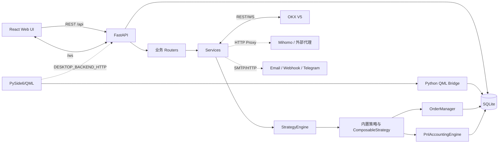
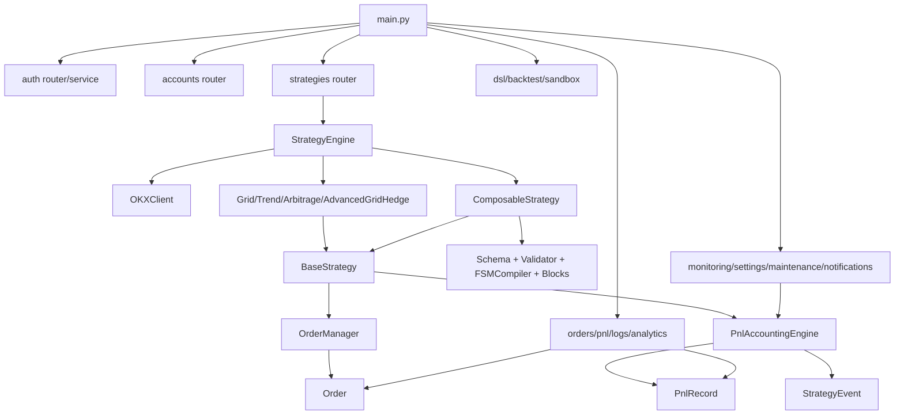
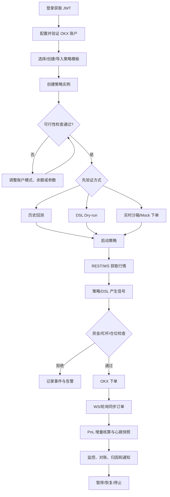

# QuantOKX 系统架构

## 1. 整体架构

QuantOKX 是模块化单体应用，而非微服务。Web UI 与桌面 UI 是两套客户端；业务状态主要由同一个 Python 进程和本地 SQLite 管理。外部依赖包括 OKX REST/WebSocket、可选代理核心以及通知渠道。

### 前后端关系

- 开发：Vite `5173` 提供 UI，并代理 `/api`、`/ws` 到 FastAPI `8000`。
- 构建：`npm run build` 产出 `frontend/dist`；`backend/main.py` 将其挂在 `/`，`SPAStaticFiles` 对无扩展名的 React 路由回退 `index.html`。
- 前端 Axios `baseURL=/api`，超时 15 秒；回测单独 120 秒。
- 浏览器认证信息保存在 `sessionStorage`；WebSocket hook 未附加认证参数。

### 桌面关系

`desktop/main.py` 将 `AccountService`、`StrategyService`、`OrderService`、`PnlService`、`MonitoringService`、`LogService` 和 `AuthService` 暴露为 QML context properties。桥接层可直接查询 ORM；`DESKTOP_BACKEND_HTTP=1` 时还会在线程中运行 FastAPI。

## 2. 主要模块关系

| 调用方 | 被调用方 | 关系 |
|---|---|---|
| routers | services/models | 校验认证后组织业务与序列化 |
| StrategyEngine | StrategyTemplate/Instance/Account | 创建运行上下文、回写状态 |
| StrategyEngine | OKXClient | 每账户复用连接与共享缓存 |
| BaseStrategy | OrderManager | 活动订单、成交状态、异步持久化 |
| BaseStrategy/Engine | PnlAccountingEngine | 增量、心跳、停止时最终核算 |
| ComposableStrategy | DSL registry/compiler | 解析配置并执行 FSM |
| monitoring | PnL/StrategyEngine | 对账、隔离、延迟与资金指标 |
| frontend | REST/WS | 展示和管理，不直接访问数据库 |
| QML bridge | ORM/services | 本地直连，绕过 HTTP router |

## 3. 核心业务流程

## 4. 同步与异步处理

| 流程 | 模式 | 说明 |
|---|---|---|
| ORM 查询/写入 | 同步 | `SessionLocal` 使用同步 SQLite driver；async route 内也会直接调用 |
| 策略执行 | `asyncio.Task` | `StrategyEngine._tasks` 进程内维护 |
| OKX REST | 主要为 async HTTPX | 仍有 `_request` 同步兼容入口，部分同步路由用 `asyncio.run` |
| OKX WebSocket | async | 私有订单与公共行情分开客户端 |
| PnL 采样 | 后台 async loop | 15 秒处理增量或写心跳 |
| 回测 | 同步 | 请求内完成，历史结果仅驻内存 |
| 沙箱 | async task | 实时行情、Mock 写操作，结果仅驻内存 |
| 通知 | async | Email 使用线程/同步库包装，Webhook/Telegram 使用 HTTPX |
| 订单落库 | 异步辅助任务 | `OrderManager.flush_pending_persists` 在暂停/停止时收敛 |

## 5. 数据流和状态归属

### 账户凭证

明文只在请求与进程内短暂存在 → `encryption_service.encrypt` → Fernet 密文存入 `accounts`。Fernet key 位于 `data/.encryption_key`。数据库和 key 必须配套备份。

### 策略运行

`strategy_templates` 保存复用配置 → `strategy_instances` 合并默认参数并绑定账户/symbol → `StrategyEngine` 建立内存任务 → `OrderManager` 与 `PnlAccountingEngine` 将运行结果写回 SQLite。重启时内存任务丢失，启动钩子将残留状态改成 `stopped`。

### PnL

OKX/本地成交 → `orders` → 全量或增量 FIFO 核算 → `pnl_records` 虚拟仓位和累计值 → `/api/pnl`、监控和归因接口。真实交易所仓位与所有活跃策略虚拟仓位之和通过 reconcile 比较。

### 内存状态

以下状态不持久化：WebSocket 连接、市场最新价、StrategyEngine 任务对象、共享查询缓存、回测历史、沙箱实例。部署多个 Uvicorn worker 会造成各 worker 状态不一致；当前架构应使用单进程，除非先外置这些状态。

## 6. 缓存、超时、重试和限流

| 项目 | 实现 |
|---|---|
| 余额/持仓共享缓存 | 每账户 5 秒；失败可返回过期缓存/空值 |
| 现货 ticker | 全市场缓存 15 秒，异步锁防止并发刷新 |
| instrument | `InstrumentCache` 进程内缓存，无 TTL；未命中访问 OKX |
| 仓位冲突 | 默认 10 秒节流，返回上次结果 |
| OKX 超时 | 主客户端 connect 10s/read 15s/write 10s/pool 5s |
| 公共市场超时 | connect 8s/read 10s/write 5s/pool 3s |
| REST 限流 | 公开 20/2s，私有 60/2s，进程内 asyncio lock |
| WebSocket | 客户端有健康/熔断与 REST fallback 字段；具体恢复策略见 `okx_ws_client.py` |
| 通用业务重试 | 未发现统一重试库；各服务局部处理 |

## 7. 鉴权边界

`get_current_user` 校验 Bearer JWT、`sub` 和数据库用户。大部分 REST router 注入该依赖；公开市场、DSL 和全部 WebSocket 未注入。没有角色/权限表，也没有实例/账户级 owner 字段，因此认证等同于全局操作授权。

## 8. 架构约束与维护注意事项

- 保持单进程运行，除非把任务、锁、缓存、WS 广播和沙箱状态外置。
- SQLite 写并发和长期 PnL 心跳增长是容量边界；高频或多账户场景需评估 PostgreSQL。
- 不要在 async route 中新增长时间同步网络调用；已有同步兼容代码应逐步收敛。
- 更新 ORM 字段时必须同时处理旧 SQLite 的兼容迁移；`create_all` 不会修改已有表。
- 新路由应定义 Pydantic request/response model，减少裸 `dict` 契约漂移。
- 对外部署前必须补 WebSocket 鉴权、统一限流、TLS、结构化日志和备份恢复演练。
