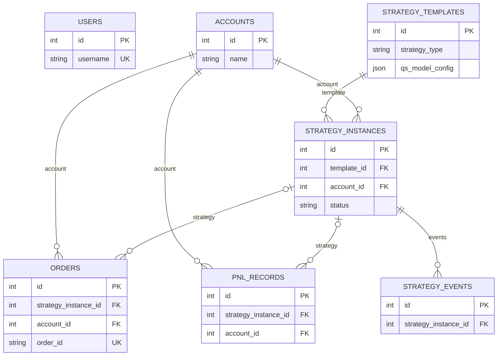

# QuantOKX 数据结构与数据字典

## 1. 数据库概览

| 项目 | 实现 |
|---|---|
| 数据库 | SQLite，源码模式 `data/quant_okx.db`；冻结程序 `%APPDATA%/QuantOKX/data/quant_okx.db` |
| ORM | SQLAlchemy 2.x，同步 `create_engine` 和 `SessionLocal` |
| 声明 URL | `sqlite+aiosqlite:///...`，Engine 创建时移除 async driver 部分 |
| 建表 | 启动时 `Base.metadata.create_all` |
| 迁移 | `database.py` 内启动兼容迁移 + `backend/migrations/` 独立脚本；未使用 Alembic |
| 删除 | 没有软删除字段；业务删除和维护清理均为物理删除 |
| 时间 | Python 默认 UTC；SQLite 可能返回 naive datetime |

## 2. 实体关系



`operation_logs.user_id` 和 `api_call_logs.strategy_instance_id` 在 ORM 中没有 ForeignKey；`notification_rules`、`user_settings`、`system_settings` 独立。ORM 未声明 relationship/cascade，删除父记录时的孤儿和外键行为依赖 SQLite 设置；代码未显式启用 `PRAGMA foreign_keys=ON`，需谨慎清理。

## 3. 表结构

### `users`

用途：Web/桌面认证用户。首次空库自动创建默认管理员。

| 字段 | 类型 | 可空 | 默认 | 约束/索引 | 说明 |
|---|---|---:|---|---|---|
| `id` | INTEGER | 否 | 自增 | PK，index | 用户 ID |
| `username` | VARCHAR | 否 | 无 | UNIQUE，index | 登录名 |
| `password_hash` | VARCHAR | 否 | 无 |  | bcrypt hash |
| `login_attempts` | INTEGER | 是 | `0` |  | 连续失败次数 |
| `locked_until` | DATETIME | 是 | null |  | 锁定截止时间 |
| `created_at` | DATETIME | 是 | UTC now |  | 创建时间 |

### `accounts`

用途：OKX 账户及加密凭证。

| 字段 | 类型 | 可空 | 默认 | 约束/索引 | 说明 |
|---|---|---:|---|---|---|
| `id` | INTEGER | 否 | 自增 | PK，index | 账户 ID |
| `name` | VARCHAR | 否 | 无 |  | 显示名 |
| `api_key_encrypted` | VARCHAR | 否 | 无 |  | Fernet 密文 |
| `secret_key_encrypted` | VARCHAR | 否 | 无 |  | Fernet 密文 |
| `passphrase_encrypted` | VARCHAR | 是 | null |  | Fernet 密文 |
| `trade_mode` | VARCHAR | 是 | `demo` |  | `demo`/`live`，DB 无 CHECK |
| `exchange` | VARCHAR | 是 | `okx` |  | 当前仅 OKX |
| `is_active` | BOOLEAN | 是 | true |  | 是否可用 |
| `created_at` | DATETIME | 是 | UTC now |  | 创建时间 |
| `updated_at` | DATETIME | 是 | UTC now | onupdate | 更新时间 |

### `strategy_templates`

用途：可复用的内置/自定义策略模板。

| 字段 | 类型 | 可空 | 默认 | 约束/索引 | 说明 |
|---|---|---:|---|---|---|
| `id` | INTEGER | 否 | 自增 | PK，index | 模板 ID |
| `name` | VARCHAR | 否 | 无 |  | 自定义同名由业务代码限制 |
| `strategy_type` | VARCHAR | 否 | 无 |  | grid/trend/arbitrage/advanced_grid_hedge/composable |
| `description` | VARCHAR | 是 | null |  | 描述 |
| `default_params` | JSON | 否 | 无 |  | 默认实例参数 |
| `param_schema` | JSON | 是 | null |  | 前端表单元数据 |
| `is_builtin` | BOOLEAN | 是 | false |  | 内置模板不可删除 |
| `is_custom` | BOOLEAN | 是 | false |  | 用户模板 |
| `created_at` | DATETIME | 是 | UTC now |  | 创建时间 |
| `dsl_config` | JSON | 是 | null |  | 旧 DSL 配置 |
| `qs_model_config` | JSON | 是 | null |  | QS-Model v2 配置 |
| `logic_hash` | VARCHAR | 是 | null | index | logic 规范 JSON 的 SHA-256 |

### `strategy_instances`

用途：绑定模板、账户和 symbol 的可运行实例。

| 字段 | 类型 | 可空 | 默认 | 约束/索引 | 说明 |
|---|---|---:|---|---|---|
| `id` | INTEGER | 否 | 自增 | PK，index | 实例 ID |
| `template_id` | INTEGER | 否 | 无 | FK `strategy_templates.id` | 模板 |
| `account_id` | INTEGER | 否 | 无 | FK `accounts.id` | 账户 |
| `name` | VARCHAR | 否 | 无 |  | 实例名 |
| `symbol` | VARCHAR | 否 | 无 |  | 如 `BTC-USDT-SWAP` |
| `market_type` | VARCHAR | 否 | 无 |  | `spot`/`swap`，无 DB CHECK |
| `params` | JSON | 否 | 无 |  | 合并后的运行参数 |
| `status` | VARCHAR | 是 | `stopped` |  | running/paused/stopped/error |
| `started_at` | DATETIME | 是 | null |  | 最近启动时间 |
| `stopped_at` | DATETIME | 是 | null |  | 最近停止时间 |
| `created_at` | DATETIME | 是 | UTC now |  | 创建时间 |
| `updated_at` | DATETIME | 是 | UTC now | onupdate | 更新时间 |
| `logic_hash` | VARCHAR | 是 | null |  | 创建/更新时逻辑版本快照 |

### `orders`

用途：策略订单、交易所状态与 PnL 核算标志。

| 字段 | 类型 | 可空 | 默认 | 约束/索引 | 说明 |
|---|---|---:|---|---|---|
| `id` | INTEGER | 否 | 自增 | PK，index | 本地 ID |
| `strategy_instance_id` | INTEGER | 是 | null | FK `strategy_instances.id` | 可为空的归属策略 |
| `account_id` | INTEGER | 否 | 无 | FK `accounts.id`，index | 账户 |
| `symbol` | VARCHAR | 否 | 无 |  | instrument ID |
| `order_id` | VARCHAR | 是 | null | UNIQUE；启动迁移建唯一索引 | OKX `ordId` |
| `cl_ord_id` | VARCHAR | 是 | null |  | 客户端订单 ID |
| `side` | VARCHAR | 否 | 无 |  | buy/sell |
| `order_type` | VARCHAR | 否 | 无 |  | limit/market 等 |
| `price` | FLOAT | 是 | null |  | 委托价 |
| `quantity` | FLOAT | 是 | null |  | 委托量 |
| `filled_quantity` | FLOAT | 是 | `0` |  | 累计成交量 |
| `fill_px` | FLOAT | 是 | null |  | 实际成交价 |
| `fill_sz` | FLOAT | 是 | null |  | 实际成交张数/数量 |
| `fee` | FLOAT | 是 | null |  | 手续费 |
| `state` | VARCHAR | 是 | null |  | OKX 原始状态 |
| `status` | VARCHAR | 是 | null |  | 本地状态 |
| `update_time` | VARCHAR | 是 | null |  | OKX 更新时间字符串 |
| `created_at` | DATETIME | 是 | UTC now |  | 创建时间 |
| `updated_at` | DATETIME | 是 | UTC now |  | 更新时间 |
| `pnl_accounted` | BOOLEAN | 否 | false/0 | 复合索引 | 是否已进入核算 |
| `ct_val` | FLOAT | 是 | null |  | 合约面值 |
| `ct_type` | VARCHAR | 是 | null |  | 合约类型 |
| `settle_ccy` | VARCHAR | 是 | null |  | 结算币种 |
| `actual_qty` | FLOAT | 是 | null |  | 换算后的资产实际数量 |

复合索引：`(strategy_instance_id, status, pnl_accounted)`。

### `pnl_records`

用途：策略/账户的时点 PnL 和虚拟持仓快照。

| 字段 | 类型 | 可空 | 默认 | 约束/索引 | 说明 |
|---|---|---:|---|---|---|
| `id` | INTEGER | 否 | 自增 | PK，index | 记录 ID |
| `account_id` | INTEGER | 否 | 无 | FK `accounts.id`，index | 账户 |
| `strategy_instance_id` | INTEGER | 是 | null | FK `strategy_instances.id` | 策略；旧/汇总数据可空 |
| `equity` | FLOAT | 是 | null |  | 总权益 |
| `unrealized_pnl` | FLOAT | 是 | null |  | 时点未实现盈亏 |
| `realized_pnl` | FLOAT | 是 | null |  | 累计已实现盈亏 |
| `total_pnl` | FLOAT | 是 | null |  | 两者合计 |
| `is_final` | BOOLEAN | 否 | false/0 |  | 停止最终记录标志 |
| `recorded_at` | DATETIME | 是 | UTC now | index | 快照时间 |
| `net_position` | FLOAT | 是 | null |  | 带符号虚拟净持仓 |
| `avg_buy_price` | FLOAT | 是 | null |  | 平均买入价 |
| `total_fee` | FLOAT | 是 | null |  | 累计手续费 |
| `order_count` | INTEGER | 是 | null |  | 已核算订单数 |

复合索引：`(strategy_instance_id, recorded_at)`。心跳默认每 15 秒可新增一条记录。

### `operation_logs`

用途：登录、账户和策略管理操作审计。

| 字段 | 类型 | 可空 | 默认 | 约束/索引 | 说明 |
|---|---|---:|---|---|---|
| `id` | INTEGER | 否 | 自增 | PK，index | ID |
| `user_id` | INTEGER | 是 | null | 无 FK | 操作用户 |
| `action` | VARCHAR | 否 | 无 |  | 动作名 |
| `target_type` | VARCHAR | 是 | null |  | 目标类型 |
| `target_id` | INTEGER | 是 | null |  | 目标 ID |
| `detail` | JSON | 是 | null |  | 详情，禁止保存凭证 |
| `ip_address` | VARCHAR | 是 | null |  | 请求 IP |
| `created_at` | DATETIME | 是 | UTC now | index | 时间 |

### `api_call_logs`

用途：OKX API 调用审计/诊断。

| 字段 | 类型 | 可空 | 默认 | 约束/索引 | 说明 |
|---|---|---:|---|---|---|
| `id` | INTEGER | 否 | 自增 | PK，index | ID |
| `strategy_instance_id` | INTEGER | 是 | null | index，无 FK | 策略 ID |
| `account_name` | VARCHAR | 是 | null |  | 账户名 |
| `endpoint` | VARCHAR | 否 | 无 |  | OKX endpoint |
| `method` | VARCHAR | 否 | 无 |  | HTTP 方法 |
| `request_body` | TEXT | 是 | null |  | 请求摘要，需脱敏 |
| `response_code` | VARCHAR | 是 | null |  | OKX code |
| `response_body` | TEXT | 是 | null |  | 响应摘要 |
| `status` | VARCHAR | 是 | `success` |  | 本地分类 |
| `created_at` | DATETIME | 是 | UTC now | index | 时间 |

### `strategy_events`

用途：策略生命周期、风控、对账、错误和研究事件。

| 字段 | 类型 | 可空 | 默认 | 约束/索引 | 说明 |
|---|---|---:|---|---|---|
| `id` | INTEGER | 否 | 自增 | PK，index | ID |
| `strategy_instance_id` | INTEGER | 否 | 无 | FK，index | 实例 |
| `event_type` | VARCHAR | 否 | 无 | index | 事件类别 |
| `message` | VARCHAR | 否 | 无 |  | 人类可读信息 |
| `details` | TEXT | 是 | null |  | 常为 JSON 字符串，但 DB 类型不是 JSON |
| `created_at` | DATETIME | 是 | UTC now |  | 时间 |

### `notification_rules`

用途：通知事件到渠道的匹配规则。

| 字段 | 类型 | 可空 | 默认 | 约束/索引 | 说明 |
|---|---|---:|---|---|---|
| `id` | INTEGER | 否 | 自增 | PK，index | ID |
| `name` | VARCHAR | 否 | 无 |  | 名称 |
| `event_types` | JSON | 否 | `[]` |  | 事件类型数组 |
| `channel_type` | VARCHAR | 否 | 无 |  | email/webhook/telegram |
| `channel_config` | JSON | 否 | `{}` |  | 渠道配置，可能含敏感字段 |
| `is_active` | BOOLEAN | 否 | true |  | 启用状态 |
| `created_at` | DATETIME | 是 | UTC now |  | 创建时间 |
| `updated_at` | DATETIME | 是 | UTC now | onupdate | 更新时间 |

### `user_settings` / `system_settings`

两表结构相同，分别保存 UI 用户设置和系统/代理设置。

| 字段 | 类型 | 可空 | 默认 | 约束/索引 | 说明 |
|---|---|---:|---|---|---|
| `id` | INTEGER | 否 | 自增 | PK，index | ID |
| `key` | VARCHAR | 否 | 无 | UNIQUE，index | 配置键 |
| `value` | TEXT | 是 | 空字符串 |  | 字符串值 |
| `updated_at` | DATETIME | 是 | UTC now |  | 更新时间 |

## 4. 启动迁移

`backend/database.py:init_db` 在 `create_all` 后按顺序：

1. 给 `strategy_templates` 补 `dsl_config`、`qs_model_config`、`logic_hash`。
2. 给 `strategy_instances` 补 `logic_hash`。
3. 给 `pnl_records` 补 `is_final`。
4. 给 `orders` 补 OKX/PnL 字段、`order_id` 唯一索引和核算复合索引。
5. 给 `pnl_records` 补虚拟持仓/手续费/订单数字段和策略时间索引。
6. 给模板 logic hash 建索引。

迁移没有版本表、down migration 或统一事务回滚计划。若旧库已有重复 `order_id`，创建唯一索引会失败，需要先备份并人工清理。

`backend/migrations/add_order_pnl_fields.py`、`add_pnl_record_fields.py`、`fix_pnl_anomaly_records.py` 是独立脚本；执行条件、顺序和幂等性应先阅读脚本，不能替代启动迁移盲目重复运行。

## 5. API Pydantic 请求模型

| 模型 | 必填字段 | 可选字段/默认 | 定义位置 |
|---|---|---|---|
| `LoginRequest` | `username:string`, `password:string` | 无 | `schemas/auth.py` |
| `TokenResponse` | `access_token:string` | `token_type="bearer"` | 同上 |
| `AccountCreate` | `name,api_key,secret_key` | `passphrase=null`, `trade_mode="demo"` | 同上 |
| `AccountUpdate` | 无 | 所有账户字段均 null | 同上 |
| `ChangePasswordRequest` | `old_password,new_password` | 无 | 同上 |
| `StrategyInstanceCreate` | `template_id,account_id,name,symbol,market_type,params` | 无 | `schemas/strategy.py` |
| `StrategyInstanceUpdate` | 无 | `name=null,params=null` | 同上 |
| `StrategyTemplateCreate` | `name,strategy_type,default_params` | description/schema/DSL/QS null，`force=false` | 同上 |
| `StrategyTemplateUpdate` | 无 | 所有字段可选 | 同上 |
| `BacktestRequest` | `symbol,strategy_type,params,start_time,end_time` | `interval=1H, initial_capital=10000, slippage=0.001, fee_rate=0.001` | `routers/backtest.py` |
| `ExportRequest` | `symbol,strategy_type,params` | `name=null,notes=null` | 同上 |
| `SandboxStartRequest` | `qs_model_config,symbol` | duration 300、tick 5、account null | `routers/sandbox.py` |

许多路由使用裸 `dict`，因此字段约束只在函数内部实现；应逐步迁移为 Pydantic model。

## 6. QS-Model 与 DSL

### QS-Model 顶层

| 字段 | 类型 | 必填 | 默认/约束 | 说明 |
|---|---|---:|---|---|
| `qs_model_version` | string | 否 | `2.0` | 版本 |
| `meta` | `StrategyMeta` | 是 |  | 元信息 |
| `params` | object<string,`ParamDefinition`> | 否 | `{}` | 可变参数 |
| `logic` | `StrategyDSL` | 是 |  | 执行逻辑 |
| `risk_filter` | `RiskFilter|null` | 否 | null | 风控 |

### `StrategyMeta`

`name` 必填；`version=v1.0.0`、`author=""`、`description=""`、`asset_class=CRYPTO`、`frequency=""`、`base_symbol=""`。`base_symbol` 非空会锁定实例 symbol。

### `ParamDefinition`

`label`、`value`、`type` 必填；可选 `range`、`description`、`options`、`option_labels`、`unit`。运行时 `$params.<key>` 优先用实例 override，否则用 `value`；`$meta.<key>` 从元信息解析。未知引用保留原字符串。

### `StrategyDSL`

| 字段 | 类型 | 默认 | 说明 |
|---|---|---|---|
| `version` | literal `1.0` | `1.0` | DSL 版本 |
| `base_strategy` | `BaseStrategyRef|null` | null | 基础策略 kind/params |
| `rules` | `Rule[]` | `[]` | 规则列表 |

`Rule` 包含 `name`、`when:Trigger`、`then:ActionRef[]`，以及可选恢复触发/动作和 `cool_down_seconds=0`。`Trigger.mode` 为 `condition` 或 `event`；对应配置 `condition`、`event`，事件还可加 `extra_condition`。

```json
{
  "qs_model_version":"2.0",
  "meta":{
    "name":"RSI 示例",
    "version":"v1.0.0",
    "author":"",
    "description":"",
    "asset_class":"CRYPTO",
    "frequency":"1h",
    "base_symbol":"BTC-USDT"
  },
  "params":{
    "rsi_period":{"label":"RSI 周期","value":14,"type":"int","range":[2,100],"description":"","options":null,"option_labels":null,"unit":""}
  },
  "logic":{
    "version":"1.0",
    "base_strategy":{"kind":null,"params":{}},
    "rules":[]
  },
  "risk_filter":{"max_position_ratio":0.2,"daily_max_loss":100,"min_trade_size":0.001,"blacklist_hours":null,"stop_loss":null,"take_profit":null}
}
```

## 7. 主要响应/前端类型

| 类型 | 核心字段 | 来源 |
|---|---|---|
| `Account` | id,name,trade_mode,exchange,is_active,api_key_masked,created_at | accounts router / `types/index.ts` |
| `BalanceData` | total_equity,assets,asset_count | accounts router |
| `StrategyTemplate` | template fields + dsl/qs_model/logic_hash/duplicate_hint | strategies router |
| `StrategyInstance` | template/account/name/symbol/params/status/timestamps | strategies router |
| `Order` | OKX IDs、side/type、价格数量、成交、状态和时间 | orders router |
| `PnlRecord` | equity、realized/unrealized/total、position、fee、count、time | pnl router |
| `OperationLog` | action、target、detail、IP、time | logs router |
| `HealthMetrics` | strategies 与 alerts | monitoring router |
| `BacktestResult` | config,trades,equity_curve,metrics,kline_count,error | backtest engine/router |
| `ValidationResult` | valid,errors(layer/code/message/path) | DSL validator |
| `DryRunResult` | steps,total_ticks,triggered_count,state_changes,final_state | DSL dry-run |

前后端类型没有自动生成关系；字段变更时必须同时检查 `frontend/src/types`、`frontend/src/api` 和后端 return dict。

## 8. 数据备份与恢复

源码模式至少同时备份 `data/quant_okx.db` 和 `data/.encryption_key`；冻结程序备份 `%APPDATA%/QuantOKX/data/` 整个目录。仅恢复数据库而缺少原 key 将无法解密账户凭证。项目未提供在线一致性备份脚本、校验和或恢复演练命令；建议停服务后复制，恢复前保留原目录并先在隔离环境验证。
